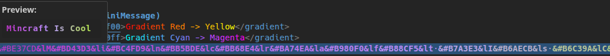

# Minecraft Colors in Files

> See your Minecraft color codes come to life as you type.


---

## What it does

This extension highlights Minecraft color codes directly in your editor. No more guessing what `&c` or `<gradient:#ff0000:#00ff00>` looks like - just see it.

**Supports:**
- Legacy codes (`&c`, `&l`, `&o`)
- Legacy hex (`&#FF5555`)
- MiniMessage (`<red>`, `<bold>`, `<gradient:...>`)

---

## Preview




Select any text with color codes and hover to see a rendered preview.

---

## Formats

### Legacy
| Code | Color | Code | Color |
|------|-------|------|-------|
| `&0` | Black | `&8` | Dark Gray |
| `&1` | Dark Blue | `&9` | Blue |
| `&2` | Dark Green | `&a` | Green |
| `&3` | Dark Aqua | `&b` | Aqua |
| `&4` | Dark Red | `&c` | Red |
| `&5` | Dark Purple | `&d` | Light Purple |
| `&6` | Gold | `&e` | Yellow |
| `&7` | Gray | `&f` | White |

| Code | Format |
|------|--------|
| `&l` | **Bold** |
| `&o` | *Italic* |
| `&n` | Underline |
| `&m` | ~~Strikethrough~~ |
| `&k` | Obfuscated |
| `&r` | Reset |

### Legacy Hex
```
&#FF5555  &#55FF55  &#5555FF
```

### MiniMessage
```xml
<red>colored text</red>
<#FF5555>hex color</#FF5555>
<bold><italic>formatted</italic></bold>
<gradient:#ff0000:#00ff00>smooth gradient</gradient>
```

---

## Settings

All settings default to `true`. Disable what you don't need:

```json
{
  "minecraftColors.legacy.enabled": true,
  "minecraftColors.legacy.colors": true,
  "minecraftColors.legacy.formatting": true,
  "minecraftColors.legacyHex.enabled": true,
  "minecraftColors.miniMessage.enabled": true,
  "minecraftColors.miniMessage.colors": true,
  "minecraftColors.miniMessage.formatting": true,
  "minecraftColors.miniMessage.gradients": true
}
```

---

## Commands

| Command | Description |
|---------|-------------|
| `Toggle Minecraft Color Highlighting` | Turn highlighting on/off |

---

## Install

**Marketplace:** Search "Minecraft Colors in Files" in VS Code extensions

**Manual:** Download `.vsix` from releases → Extensions → `...` → Install from VSIX

---

## Development

```bash
git clone https://github.com/thejacedev/minecraft-colors-in-files.git
cd minecraft-colors-in-files
npm install
npm run compile
# Press F5 to run
```

---

## License

MIT
