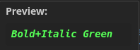

# Minecraft Colors in Files

**See your Minecraft color codes come to life as you type.**

[](https://marketplace.visualstudio.com/items?itemName=jacesleeman.minecraft-colors-in-files)
[](https://marketplace.visualstudio.com/items?itemName=jacesleeman.minecraft-colors-in-files)
[](https://opensource.org/licenses/MIT)



## Features

- **Legacy Codes** - `&c`, `&l`, `&o`, `&k` and more
- **Legacy Hex** - `&#FF5555`
- **MiniMessage** - `<red>`, `<bold>`, `<#FF5555>`
- **Gradients** - `<gradient:#ff0000:#00ff00>text</gradient>`
- **Hover Preview** - Select text and hover to see rendered output
- **Custom Variables** - Map `${COLORS.primary}` to any color

## Color Codes

```
&0 Black       &8 Dark Gray
&1 Dark Blue   &9 Blue
&2 Dark Green  &a Green
&3 Dark Aqua   &b Aqua
&4 Dark Red    &c Red
&5 Dark Purple &d Light Purple
&6 Gold        &e Yellow
&7 Gray        &f White

&l Bold  &o Italic  &n Underline  &m Strikethrough  &k Obfuscated  &r Reset
```

## MiniMessage

```xml
<red>colored text</red>
<#FF5555>hex color</#FF5555>
<bold><italic>formatted</italic></bold>
<gradient:#ff0000:#00ff00>smooth gradient</gradient>
```

## Settings

```json
{
  "minecraftColors.legacy.enabled": true,
  "minecraftColors.legacy.colors": true,
  "minecraftColors.legacy.formatting": true,
  "minecraftColors.legacyHex.enabled": true,
  "minecraftColors.miniMessage.enabled": true,
  "minecraftColors.miniMessage.colors": true,
  "minecraftColors.miniMessage.formatting": true,
  "minecraftColors.miniMessage.gradients": true,
  "minecraftColors.customVariables": {
    "COLORS.primary": "#FF5555",
    "COLORS.secondary": "&a"
  }
}
```

## Commands

- `Toggle Minecraft Color Highlighting` - Turn on/off

## License

MIT
